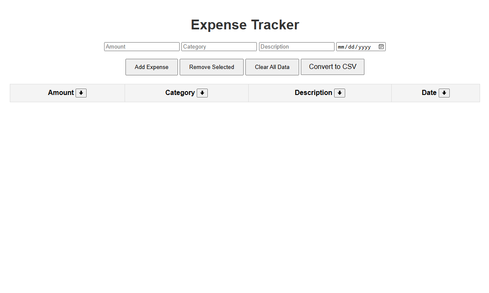

# Expense Tracker

## Description

The Expense Tracker is a web application that allows users to track their expenses. Users can add, remove, clear, sort, and export expenses. The application is built using Flask, a lightweight web framework for Python, and MySQL for the database.

## Files

### `app.py`

This is the main Flask application file. It contains the routes for the application and handles form submissions.

### `Database.py`

This file contains the `Database` class, which handles interactions with the MySQL database. It includes methods for adding, removing, and retrieving expenses.

### `static/home.css`

This file contains the CSS styles for the application.

### `templates/home.html`

This is the main HTML template for the application. It contains the form for adding expenses and displays the list of expenses.

### `templates/login.html`

This is the HTML template for the login page.

## Setup

### Prerequisites

- Python 3.11
- MySQL

### Installation

1. Clone the repository:

   ```bash
   git clone https://github.com/yourusername/ExpenseTracker.git
   cd ExpenseTracker
   ```
2. Install the required Python packages:
  ```bash
  pip install flask mysql-connector-python pandas
  ```
3. Set up the MySQL database:
```MySQL
CREATE DATABASE expense_tracker;
USE expense_tracker;

CREATE TABLE expenses (
    expense_id INT AUTO_INCREMENT PRIMARY KEY,
    amount DECIMAL(10, 2) NOT NULL,
    category VARCHAR(255) NOT NULL,
    description TEXT,
    date DATE NOT NULL
);
```
4. Update the database connection details in your .env file:
```python
self.host = 'localhost'
self.user = 'your_mysql_username'
self.password = 'your_mysql_password'
self.database = 'expense_tracker'
```
## Running the Application
1. Start the Flask application:
```bash
python app.py
```
2. Open your web browser and go to the url posted in the terminal.

## Usage
* Add Expense: Fill in the form with the amount, category, description, and date, then click "Add Expense".
* Remove Selected: Select the expenses you want to remove by checking the checkboxes, then click "Remove Selected".
* Clear All Data: Click "Clear All Data" to remove all expenses from the database.
* Sort Current Data: Click the down arrow next each column name to sort the data based on the column
* Export data to CSV: Click "Convert to CSV" to download your current data into a .csv file for editing in Excel!

## License
This project is licensed under the MIT License. See the LICENSE file for details.

## Author
Justin Toliver

